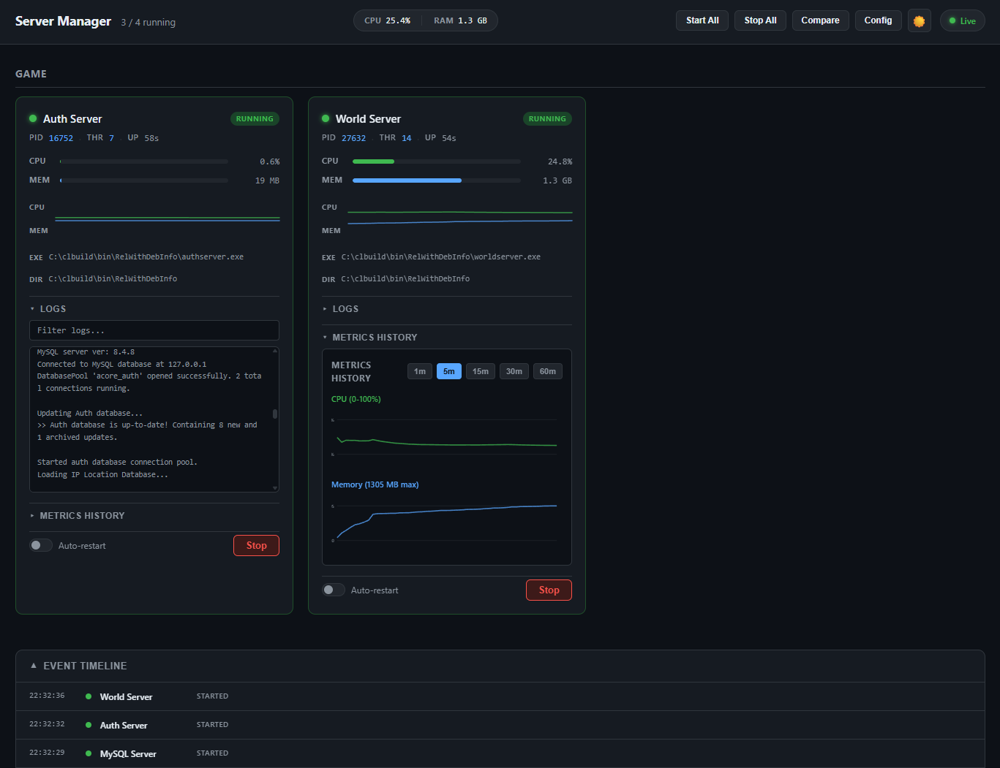
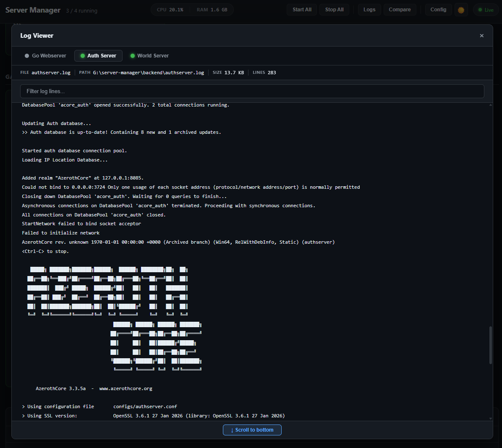

# Server Manager

A real-time process and service manager for monitoring and controlling game servers, web services, and databases on Windows.

**Originally created for managing [AzerothCore](https://www.azerothcore.org/) AuthServer and WorldServer instances**, but designed to be flexible enough to monitor and control any Windows executable or service. Created with Claude AI, so keep that in mind.

## Features

- **Real-time monitoring**: CPU, memory, thread count, uptime, with live sparklines per process
- **Header summary**: Running process count, total CPU %, and total RAM at a glance
- **Start/Stop controls**: Executables and Windows Services
- **Auto-restart**: Automatic process recovery on crash (configurable per-process)
- **Restart counter**: Badge on each card tracking how many times a process has been auto-restarted
- **Graceful shutdown**: Configurable shutdown delay with soft kill → polling → force kill, visual "STOPPING" state with countdown timer
- **Metrics history**: CPU and memory graphs (1m–60m windows)
- **Live logs**: Inline per-card log viewer with search/filter, and a dedicated full-screen log viewer (process tabs, auto-scroll, scroll-to-bottom)
- **Log file metadata**: Filename, absolute path, and live file size (KB/MB) shown in both the inline toggle and the dedicated viewer
- **Log rotation**: Configurable max file size, number of backups, and backup age limit per process
- **Process grouping**: Organize processes by category (game, web, database, custom)
- **Bulk operations**: Start/stop all processes at once, with grouped header controls to avoid accidental clicks
- **Process comparison**: Side-by-side sparkline comparison view
- **Event timeline**: Track start/stop/crash events with timestamps
- **Crash notifications**: Toast alerts on unexpected process exit
- **Connection status**: Live/Reconnecting indicator for the WebSocket connection
- **Dark mode**: Light/dark theme toggle
- **In-app config**: Edit process configuration without restarting

## Screenshots


*Dark mode interface showing real-time process monitoring, metrics graphs, logs, and event timeline for AzerothCore Auth and World servers*


*Enhanced log viewer — per-process tabs with live auto-scrolling output, file path, size, line count, and text filtering*

## Tech Stack

- **Backend**: Go 1.21+ (port 8090)
- **Frontend**: React 19 + Vite 7 (port 5173)
- **Database**: MySQL (optional, for monitored services)

## Setup

### Prerequisites

- **Windows 10+**
- **Go 1.21+** — [Download](https://golang.org/dl/)
- **Node.js 18+** — [Download](https://nodejs.org/)
- **Administrator privileges** — Required to run the backend (for service control and process management)

### Configuration

The `backend/config.json` file contains example processes based on the original use case (AzerothCore authserver, worldserver, and a web API). **All processes are optional** — add only what you need or remove existing ones if not using them.

1. Edit `backend/config.json` and customize for your setup:
   - Replace placeholders with your actual paths (or remove processes you don't need):
     - `YOUR_GO_EXECUTABLE_PATH` → Path to `go.exe` (e.g., `C:\Program Files\Go\bin\go.exe`)
     - `YOUR_WEBSERVER_WORKING_DIR` → Your web server project directory
     - `YOUR_MYSQL_SERVICE_NAME` → Windows Service name for MySQL (if used)
     - `YOUR_AUTHSERVER_EXECUTABLE_PATH` → Path to AuthServer executable (AzerothCore)
     - `YOUR_AUTHSERVER_WORKING_DIR` → AuthServer working directory
     - `YOUR_WORLDSERVER_EXECUTABLE_PATH` → Path to WorldServer executable (AzerothCore)
     - `YOUR_WORLDSERVER_WORKING_DIR` → WorldServer working directory

2. Place `config.json` in the `backend/` directory

**Process Configuration Format:**
```json
{
  "processes": [
    {
      "id": "my-process",           // unique identifier
      "name": "My Process",          // display name
      "executable": "path/to/exe",   // path to executable (leave empty for Windows Services)
      "args": ["arg1", "arg2"],      // command-line arguments (optional)
      "working_dir": "path",         // working directory for the process
      "auto_restart": false,         // restart on crash (optional)
      "is_service": false,           // true for Windows Services
      "service_name": "",            // Windows Service name (only for services)
      "category": "web",             // grouping category (optional)
      "shutdown_delay": 5,           // graceful shutdown timeout in seconds (optional)
      "log_max_size_mb": 10,         // rotate log when it exceeds this size in MB (0 = disabled)
      "log_max_backups": 3,          // number of rotated backup files to keep (optional)
      "log_max_age_days": 7          // delete backups older than this many days (optional)
    }
  ]
}
```

**Remove any processes you don't use** — they won't affect the application.

### Backend Build & Run

```bash
cd backend
go mod download
go build -o server-manager.exe
```

**Run the backend as Administrator** (required for Windows Service control):
```bash
# Option 1: Right-click server-manager.exe → Run as administrator
# Option 2: Use PowerShell
powershell -Command "Start-Process -FilePath './server-manager.exe' -Verb RunAs"
```

The backend will start on `http://localhost:8090`

⚠️ **Important**: Without Administrator privileges, service control (start/stop MySQL, etc.) will fail silently.

### Frontend Build & Run

```bash
cd frontend
npm install
npm run dev
```

The frontend will start on `http://localhost:5173` with proxy to backend

### Production Build

Frontend:
```bash
cd frontend
npm run build
```

Output: `frontend/dist/` — serve with any static host

## Usage

1. Start backend (Administrator required for Windows Service control)
2. Start frontend dev server or serve built frontend
3. Open `http://localhost:5173` (or your frontend URL)
4. Configure process paths in the in-app config editor
5. Use controls to start/stop processes and monitor in real-time

## API Routes

| Method | Route | Description |
|--------|-------|-------------|
| GET | `/api/processes` | List all processes and status |
| POST | `/api/processes/{id}/start` | Start a process |
| POST | `/api/processes/{id}/stop` | Stop a process |
| POST | `/api/processes/start-all` | Start all processes |
| POST | `/api/processes/stop-all` | Stop all processes |
| PUT | `/api/processes/{id}/autorestart` | Toggle auto-restart |
| GET | `/api/processes/{id}/logs` | Fetch process logs (query: `?tail=N` for 1–500 lines, default 30) |
| GET | `/api/processes/{id}/metrics` | Historical metrics (query: `?minutes=N` for 1-60 minute window) |
| GET | `/api/config` | Fetch current configuration |
| PUT | `/api/config` | Update configuration (with validation) |
| GET | `/api/events` | Fetch event timeline |
| GET | `/ws` | WebSocket endpoint (real-time updates) |

## Architecture

- **Backend (`backend/`)**: Go HTTP server with WebSocket support
  - `main.go` — Server setup and routing
  - `config.go` — Configuration loading
  - `process.go` — Process/service management
  - `handlers.go` — API endpoint handlers
  - `ws.go` — WebSocket connections
  - `metrics.go` — Metrics storage (1-hour history)
  - `events.go` — Event timeline storage

- **Frontend (`frontend/`)**: React + Vite
  - `App.jsx` — Main app layout, WebSocket connection, header controls
  - `components/ProcessCard.jsx` — Per-process card with stats, sparklines, inline logs
  - `components/LogViewer.jsx` — Full-screen log viewer modal with process tabs
  - `components/MetricsChart.jsx` — SVG CPU/memory history graphs
  - `components/ConfigEditor.jsx` — In-app JSON config editor modal
  - `components/ComparisonView.jsx` — Side-by-side process sparkline comparison
  - `components/EventTimeline.jsx` — Collapsible start/stop/crash event log
  - `components/Toast.jsx` — Crash notification toasts

## Important Notes

### Security & Permissions
- **Administrator required**: Backend must run as Administrator for Windows Service control and to manage processes
- **CORS restriction**: Backend allows requests only from `localhost:5173` — not designed for public access

### Process Management
- **Worldserver stdin**: If monitoring WorldServer, keep stdin pipe open — closing it will cause immediate exit
- **Graceful shutdown**: Processes support `shutdown_delay` field (seconds to wait before force-killing). The UI shows a "STOPPING" badge with a countdown timer during graceful shutdown. Service stops (`net stop`) no longer block monitoring of other processes
- **Config location**: `config.json` must be in the `backend/` directory (not the binary directory)
- **Optional processes**: Add only the processes you need — unused entries can be removed

### Monitoring & Data
- **Log files**: Stored in backend working directory (e.g., `authserver.log`, `worldserver.log`)
- **WebSocket updates**: Real-time metrics pushed every 1 second (do not modify without testing)
- **Metrics retention**: Historical data kept for 1 hour (3600 samples per process)
- **Event timeline**: Stores up to 500 most recent start/stop/crash events

## License

This project is licensed under the **MIT License** — see the [LICENSE](LICENSE) file for details.

You are free to:
- ✅ Use, modify, and distribute the software
- ✅ Use it for commercial and private purposes
- ✅ Include it in other projects

You must:
- ✓ Include a copy of the license
- ✓ Credit the original author
